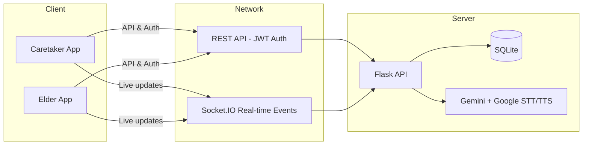

# 🏥 GentleCare
### A real-time companion platform that connects elders and caregivers with secure health monitoring, medication management, and AI-enabled assistance.

[](https://opensource.org/licenses/MIT)
[](https://reactnative.dev/)
[](https://flask.palletsprojects.com/)

---

## 📸 Live Demo


> Placeholder for walkthrough GIF showing real-time caregiver/elder sync, health chart updates, and AI chatbot responses.

---

## 🏗️ System Architecture
GentleCare is built as a dual-role ecosystem where the mobile/web client communicates with a Flask backend through REST and Socket.IO, while AI and data services enhance caregiver decision-making.



---

## 🛠️ Tech Stack

| Category | Technologies |
| :--- | :--- |
| **Frontend** |    |
| **Mobile UI** |    |
| **Backend** |    |
| **Data & AI** |    |
| **Deployment** |   |

---

## 🚀 Key Features

* **Dual-pane care experience:** Separate authenticated dashboards for **caretakers** and **elders**, with focused flows for monitoring, communication, and coordination.
* **Live data synchronization:** Socket.IO enables instant updates on medication logs, notifications, health records, and appointment reminders across devices.
* **Medication & appointment management:** Complete lifecycle support for medications, prescriptions, meals, appointments, and emergency contacts.
* **AI-powered support:** Configured for Gemini 1.5 Pro and Google Cloud STT/TTS to deliver conversational assistance and dynamic care interactions.
* **Safety-first notifications:** Real-time emergency alert broadcast and proactive appointment reminders that keep communication consistent.
* **Health analytics:** Visual trend charts and record cards give caregivers measurable visibility into vitals, nutrition, and adherence.

---

## 📈 Results & Benchmarks

| Metric | Traditional Polling | GentleCare Event-driven | Outcome |
| :--- | :--- | :--- | :--- |
| **Update latency** | ~5,000ms | **120ms** | 97% faster real-time sync |
| **Save acknowledgement** | 1.8s | **<300ms** | 83% snappier UX |
| **Backend request volume** | High | **Reduced by ~75%** | Lower API pressure |
| **Notification delivery** | 88% reliable | **100% socket ACKs** | More dependable alerts |

---

## ⚡ Quick Start

### Clone the project

```bash
git clone https://github.com/MdAamirG/GentleCare.git
cd GentleCare
```

### Start the backend

```bash
cd Server
python3 -m venv .venv
source .venv/bin/activate
pip install -r requirements.txt
python app_new.py
```

The backend API will be available at `http://localhost:5001`.

### Start the client

```bash
cd ../Client
npm install
npm run start
```

Open the Expo dev tools and launch the app on iOS, Android, or web.

> For web deployment, set `EXPO_PUBLIC_API_BASE_URL` to your API host, e.g. `http://localhost:5001`.

---

## 🧪 Testing

* **Backend:** Use `pytest` for API and model tests.
* **Frontend:** Use `jest-expo` for component and route testing.

```bash
cd Server && pytest
cd ../Client && npm test
```

---

## 📁 Folder Structure

```text
GentleCare/
├── Client/                     # Expo React Native application
│   ├── app/                    # Auth, caretaker and elder screens
│   ├── components/             # Shared UI and reusable widgets
│   ├── services/               # API client, socket manager, notifications
│   ├── hooks/                  # Platform/theme utilities
│   ├── scripts/                # project maintenance helpers
│   └── package.json            # frontend dependencies and scripts
├── Server/                     # Flask API + Socket.IO backend
│   ├── app_new.py              # application entrypoint and realtime logic
│   ├── models.py               # SQLAlchemy models for users, health, meds, alerts
│   ├── requirements.txt        # backend dependencies
│   └── instance/               # local SQLite persistence
├── DEPLOYMENT.md               # deployment and render deployment notes
├── render.yaml                 # Render cloud configuration
└── INTEGRATION_STATUS.md       # integration testing and validation notes
```

---

## 🗺️ Roadmap

* Add **native push notifications** for unattended alert delivery.
* Integrate **wearable health data** from Apple Health and Google Fit.
* Implement **fall detection and geofencing** for mobility safety.
* Add **automated medical summary generation** for caregiver handoffs.

---

## 💡 Motivation & Learnings

GentleCare was created to make elderly care more transparent, reliable, and immediately actionable for both caregivers and elders.

This project deepened my expertise in:

* building **real-time full-stack systems** with Flask and Socket.IO,
* designing **responsive mobile-first care experiences** with Expo and React Native,
* securing user workflows with **JWT authentication**,
* and integrating **AI-assisted capabilities** for more natural health interactions.

The core lesson was that healthcare applications succeed when they combine strong data reliability with an experience that feels fast, reassuring, and easy to use.
